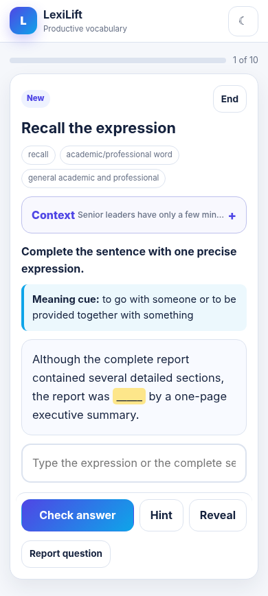

# LexiLift Vocabulary Coach - Mobile Edition v4

LexiLift is a free, mobile-first American English vocabulary coach that helps learners move from passive recognition to accurate, spontaneous use.



## Opening directly on a phone

Use `LexiLift_phone_standalone.html` to open the app directly from Files or Downloads. It contains compressed lesson data and does not need a server. The regular `index.html` is the faster hosted version for GitHub Pages.

## Curriculum

- 700 academic and professional words
- 300 common American English phrasal verbs
- 6,000 contextual exercises
- Recall, contextual choice, sentence upgrading, speaking, writing, and pronunciation practice
- Separate evidence for recognition, recall, grammar, collocation, production, retention, and pronunciation
- Long-term spaced repetition stored locally in the browser

## Mobile improvements in v4

- Fixed bottom navigation for one-handed phone use
- Compact typography and single-column lesson cards
- Rich context kept in an expandable panel instead of filling the screen
- Sticky answer controls during practice
- No navigation bar during a question, leaving more space for the task
- Card-based vocabulary library instead of a wide desktop table
- Touch targets at least 44 pixels high
- Safe-area support for modern iPhones
- Installable Progressive Web App behavior
- Offline caching after the first successful visit
- Chunked lesson data: the 1,000-item catalog loads first, while detailed exercise sets load only when needed

## Publish at `USERNAME.github.io`

Create a public GitHub repository named exactly:

```text
YOUR-GITHUB-USERNAME.github.io
```

Upload the contents of this folder to the repository root, not the enclosing folder. Then open:

**Repository Settings > Pages > Build and deployment > GitHub Actions**

The included workflow will publish the site automatically. The website address will be:

```text
https://YOUR-GITHUB-USERNAME.github.io/
```

See [PUBLISH_TO_GITHUB.md](PUBLISH_TO_GITHUB.md) for detailed instructions.

## Repository structure

- `index.html` - small application shell
- `assets/app.js` - learning engine and user interface
- `assets/styles.css` - mobile-first responsive design
- `data/catalog.json` - lightweight searchable 1,000-item catalog
- `data/items-00.json` through `data/items-09.json` - lesson data loaded on demand
- `manifest.webmanifest` - installable-app metadata
- `service-worker.js` - offline caching
- `downloads/` - full JSON, CSV, TSV, and exercise datasets
- `.github/workflows/pages.yml` - automatic GitHub Pages deployment

## Privacy

LexiLift does not require an account and includes no ads, trackers, or analytics. Progress and question reports stay in the user's browser unless the user exports them.

## Limitations

- Progress does not automatically sync between devices.
- Speech recognition and speech synthesis support varies by browser.
- Open speaking and writing tasks use guided self-assessment rather than a server-side AI evaluator.
- Language quality can involve judgment; learners can report a questionable item inside the app.

## License

The application code and original project materials are available under the MIT License. The vocabulary dataset is provided for educational use with the project.
